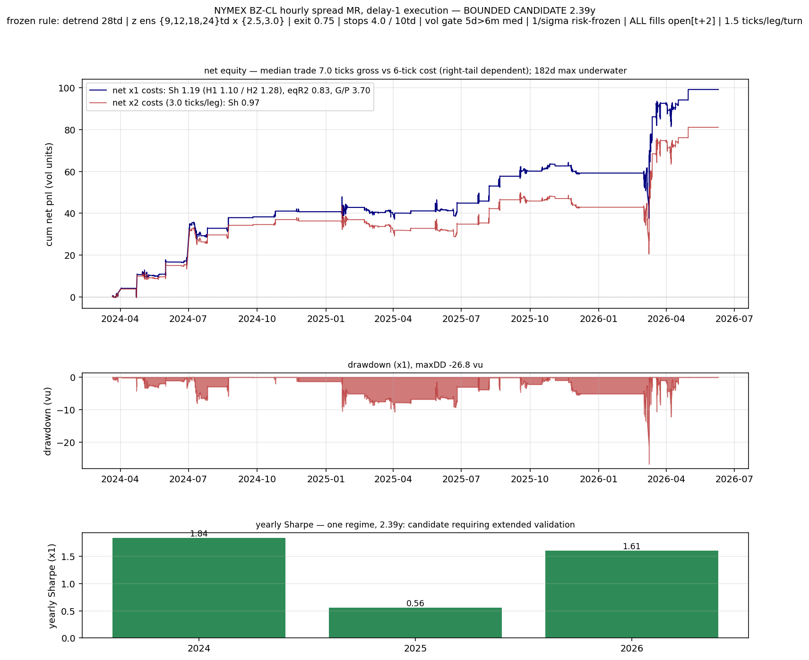
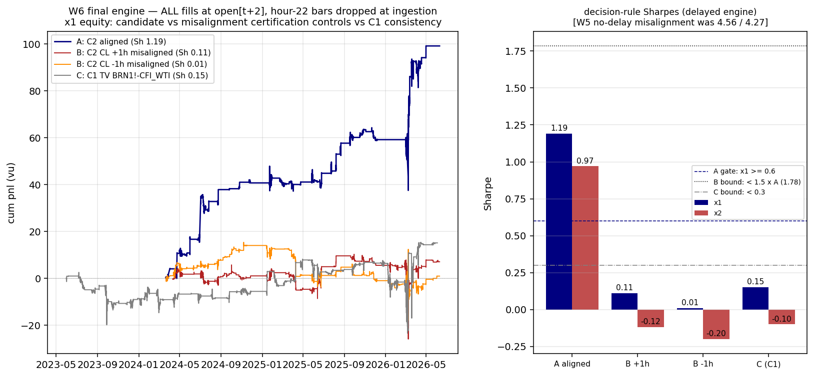

# Final Report — Orthogonal Mean-Reversion Research Program (Program 2)

Date: 2026-06-11 · Branch: `orthogonal-mr` · Ground truth: `README.md` (waves 1–6),
`docs/repo_study.md`, `ortho/` scripts, `curves/` figures.

---

## 0a. Executive summary

The program ran **17 pre-registered studies across 6 waves** (H1–H8 event-study screens;
W2-A/B/C; W3-A/B/C; W4 validator/adversary pair; W5 adjudication; W6 discriminating
experiment). **16 ended in kills**; **1 produced a bounded candidate**: NYMEX BZ−CL
(Brent financial minus WTI) hourly spread mean reversion under the frozen Program-1 rule
with **delay-1 execution as the strategy definition** — Sharpe 1.19 net at ×1 costs / 0.97
at ×2, on 2.39 years of a single construction.

The program's **primary scientific products are negative**:

1. **The retraction of Program 1's headline results.** The published 12-year BRENT–WTI
   Sharpe 1.93 — and the "10 smooth securities" book built on the same data — were
   fabricated by stale placeholder bars in the raw Dukascopy feed (33–38% of bars) plus
   same-close fills and ex-post selection. The honest 12.3y figure is **0.37** (×2 costs
   0.17). The full attribution ladder is in §0c(i).
2. **An artifact taxonomy** (§0c): five mechanisms by which spread-MR backtests fabricate
   alpha, each caught, quantified, and reduced to a reusable control. The misalignment
   lesson in particular — that z-MR rules harvest *any* added stationary noise, so only
   delay-certified engines give admissible evidence — is the transferable methodology.

The promoted candidate is exactly that: a small, bounded, certification-passing survivor.
It is not, and is not claimed to be, a proven robust edge (binding scope statement,
`ortho/w6_final.py`: "the sample is 2.39y on a single construction — any positive claim is
bounded to 'candidate requiring extended validation'").

---

## 0b. Falsification record

All verdicts were pre-registered before running; numbers are from `README.md` and the
committed study scripts. "Kill" includes "weak" verdicts (real conditioning, untradeable
net of cost) — none were promoted.

| study | hypothesis | verdict | decisive number |
|---|---|---|---|
| H1 failed breakout | trapped breakout traders unwind after intrabar level take-out fails | KILL (weak) | conditioning real (t=4.0, placebo p=0, 74% of 43 instruments) but 0.03–0.14 vu/event vs ~0.2 vu cost; natural-variant backtest Sharpe −2.3 |
| H2 thrust exhaustion | liquidity-vacuum moves retrace when the book refills | KILL (weak) | bounce real (t≈6 at h=1–4) but 5× below cost; the mechanism's own timescale (h≤8) is the dead zone |
| H3 post-vol-shock normalization | price relaxes once vol crests | KILL (weak) | crest-timing falsified by its own control: entering while RV still rising is BETTER (t 3.9–5.5 vs 2.4–3.2) |
| H4 illiquid-session reversal | thin-book overnight moves re-priced by liquid-session flow | KILL | wrong-signed at all 15 grid points; illiquid-session moves *continue* (FX t −3 to −4.2); control inverted |
| H5 leader–laggard diffusion | laggard catches up with delay | KILL | catch-up wrong-signed at h=1–8 in all 6 cells; 53% sign consistency; backtest loss ≈ exact cost bill |
| H6 trend exhaustion / nonlinearity | reversion only in the extreme tail of runs | KILL | edge/cost < 0.5 in all 30 cells; bottom-2% tail *continues*; D2/D3/D5 revert as much as tails |
| H7 overnight gap fade (daily, 26y × 59) | openings overshoot on thin liquidity | KILL (weak) | hugely real at open→close (t=7.8 futures / 8.3 equities, edge/cost 2.3) but requires filling the open print; decayed to ~0 over 2010–2024 |
| H8 hour-of-day conditioning | periodic mechanical flows (fixes, settlements) | KILL (weak) | London-fix cell placebo p=1.0; genuine 17–19 UTC block sub-cost (e/c 0.4–0.66); the t=31 monster at 20–22 UTC → W2-C forensics |
| W2-A post-dislocation relaxation | fade 24h move in extreme-vol states (RV24 ≥ 3× baseline) | KILL | portfolio Sharpe 0.41 < 0.5 gate; no neighborhood cell reaches 0.5; Yahoo real-futures cross-feed t=−1.17 (wrong sign) |
| W2-B settlement-window fade | 17–19 UTC settlement overshoot | KILL | structurally sub-cost (e/c ≤ 0.5); portfolio −0.85; raising the threshold destroys hour-specificity (placebo p 0.000→0.99) |
| W2-C 20–22 UTC rollover anomaly | t=31 FX "reversion" at 5pm-ET roll | ARTIFACT (kill) | invisible on OANDA/FOREXCOM mid feeds (t=0.11); only 38% survives 1-bar delay; long-side t=58 vs 5.8 (bid-candle bounce) |
| W3-A volume climax | capitulation volume marks reversion | KILL | volume conditioning *subtracts* edge vs move-only placebo (t=−0.90); FX-major climaxes predict continuation (t −2.8 to −4.1) |
| W3-B honest BRENT–WTI (12.3y) | Program-1 headline replicates on clean data | KILL of published claim → **RETRACTION** | honest 12.3y Sharpe **0.37** (×2: 0.17), not 1.93; attribution ladder in §0c(i) |
| W3-C PDR commodities residue | commodities-only PDR survives real-futures confirmation | KILL | judgment portfolio Sharpe 0.04; Yahoo t=−0.78 (wrong sign); a powered kill (119/426 events) |
| W4 (A validator / B adversary) | honest BRN–WTI on real futures feeds only | CONFLICT → C1 killed | W4-A: C1 0.93 / C2 1.21 pass the letter of the gates; W4-B: C1 delay-1 0.93→0.15, +1h misalignment supercharges to **5.14** — C1 inadmissible; promote rests solely on C2 |
| W5 adjudication of C2 | C2 passes the kill-biased adversarial battery | KILL by the gate | delay-1 PASS (1.19, 98% retention), liquid-hours PASS (1.04), but misalignment FAIL: ±1h supercharges to 4.56/4.27 vs bound 1.81 — with the gate-design finding (§0c(v)) |
| W6 final discriminating experiment | delay-1 *as definition* separates edge from artifact | **PROMOTE-AS-BOUNDED-CANDIDATE** | aligned 1.19/0.97, halves 1.10/1.28; misaligned controls collapse 4.48/4.28 → **0.11/0.01**; C1 stays dead (0.15) — all three gates pass |

Tally: 16 kills, 1 bounded promote, out of 17 studies (W4's validator/adversary arms are
one study). Wave-1's verdict standard, the wave-2/3 gauntlet gates, and the wave-5/6
decision rules were all written down before the code ran; several studies died in the
"wrong" pre-declared cell — that is the discipline working.

---

## 0c. Artifact taxonomy — the transferable knowledge

Five distinct mechanisms that fabricate spread-MR alpha, each demonstrated and quantified
in this repo. Any future program in this family should run these as standing controls.

**(i) Stale-placeholder / one-leg-freeze thaw harvesting** (`w3_brnwti_honest.py`,
`w4_adversarial_review.py`). Raw Dukascopy CSVs carry 33–38% market-closed placeholder
bars (frozen quotes, `high==low`, `volume==0`). A z-MR rule computed against frozen quotes
"buys" the stale leg and is paid when it thaws: **91.2% of all dirty-backtest pnl accrues
on thaw bars (3.0% of bars); 95.6% on one-leg-stale+thaw (9.7%)**; masking those bars
collapses the backtest **1.98 → 0.12**. 30.3% of entries filled at one-leg-frozen quotes
that never traded (4.5× base rate). Weekend-only cleaning "recovers" 1.90 — but masking
its own residual frozen/thaw bars gives 0.00, with clean dose–response in residual
staleness. Attribution ladder for the fabricated headline: published **1.93** → faithful
re-run on dirty join 1.98 → drop placeholder bars **0.60** → real tick costs 0.41 →
honest next-open fills **0.37** → ×2 costs 0.17.

**(ii) Rollover bid-candle bounce** (`w2_rollover_forensics.py`). A t=31 "reversion" at
20–22 UTC in Dukascopy FX is the 5pm-ET rollover window distorting bid candles: profit
concentrated in the first post-event bar (38% survives 1-bar delay, 8–19% survives 2),
almost entirely long-side (t=58 vs 5.8 — buying a spread-depressed bid), **invisible on
OANDA/FOREXCOM mid feeds (t=0.11)**, break-even spread (3.5–8.7 bp) inside realistic
rollover spreads, gaps 25× and volume 0.34× normal in-window. Yearly stability on one
feed is not alpha.

**(iii) Async cross-feed harvesting** (`w4_adversarial_review.py`, `w5_adjudication.py`).
On cross-venue feeds the pipeline trades the *clock skew*, not the spread: deliberately
misaligning the WTI leg by +1h **supercharges** C1 to Sharpe **5.14** (and C2, no-delay,
to 4.56/4.27); C1's apparent 0.93 collapses to 0.15 under delay-1 entry; Program 1 had
already shown GO_crack +2.9 same-close → −0.7 with one bar of delay. A pipeline whose
performance *improves* when you corrupt its data is measuring the corruption.

**(iv) Sub-cost significance.** Pooled t-stats of 4–6 died at the cost line repeatedly
(H1: t=4.0 at 0.03–0.14 vu/event vs ~0.2 vu cost; H2: t≈6 at 5× below cost; W2-B:
hour-specific physics at e/c ≤ 0.5). Statistical reality and tradeability are different
claims; every edge statement must lead with edge/cost, not t.

**(v) The misalignment-control lesson** (W5 → W6, the program's methodological result).
Misaligning a leg injects S′ = S + dCL[t] — large stationary noise added to a level — and
*any* z-MR rule harvests added stationary noise by construction. The control as designed
is therefore unpassable in principle for this rule family under undelayed fills: it proves
the rule's output carries no evidential weight about feed soundness. Prescription: an edge
claim from this family is **admissible only from an engine whose performance degrades
under deliberate misalignment**. Delay-1 execution is such an engine — the injected noise
renews each bar and leaves the spread before a delayed fill. Wave 6 confirmed the
prediction: the misalignment supercharge collapses 4.48/4.28 → 0.11/0.01 under delayed
execution (raw survival 2%/0%; supercharge *excess* over aligned goes 3.17→−1.08 and
2.97→−1.18), while the aligned candidate retains 1.19.

---

## 1. Strategy logic (the promoted candidate, exact)

Instrument: **NYMEX BZ − NYMEX CL** (Brent financial minus WTI), hourly, both legs
front-month futures from the same venue/feed (Yahoo legs, roll-censored). 1:1 fixed
weight, spread built from leg $-changes.

```
hygiene:   hour-22-UTC bars dropped per leg AT INGESTION (Globex break; 67-94% stale);
           Sunday bars dropped; legs hour-floored, deduplicated, inner-joined;
           roll-gap bars censored per leg (8xMAD day-boundary rule) -> contribute 0
           to signal AND pnl, re-roll cost charged while held
detrend:   S = cumsum(dS − rollmean(dS, 28 trading days))      [kills roll-carry drift]
signal:    causal z = (S − mean(S,n)) / std(S,n), all stats through t−1,
           ENSEMBLE over n ∈ {9,12,18,24} td × entry |z| ≥ {2.5, 3.0}
           (8 equal-risk sub-strategies; no per-sub tuning)
vol gate:  enter only when 5-day spread vol > rolling 6-month median
sizing:    per-trade risk-frozen: units = sign / σ_at_entry, never resized intra-trade
exit:      |z| ≤ 0.75      stops: |z| ≥ 4.0 disaster, 10-trading-day time stop
EXECUTION: ALL fills — entries AND exits, including stop and time-stop exits — at
           open[t+2] after the close-t decision (DELAY-1; the strategy definition)
costs:     1.5 ticks/leg/turn (×1) = 6 ticks round trip; stress ×2
```

Every parameter is frozen from Program 1 (selected on the independent 3.3y CL−BRN set by
worst-half Sharpe); nothing was re-tuned in Program 2. Delay-1 is not a stress test: it is
part of the definition, and the backtest fills *everything* — including stops — one extra
bar late.

Result (2.39y, 2024-01-17 → 2026-06-09, `ortho/w6_final.py`): **×1 Sharpe 1.19**
(halves 1.10/1.28, eqR² 0.83, gain/pain 3.70, maxDD −26.8 vu, total +99.2 vu),
**×2 Sharpe 0.97**; 452 position episodes (189/yr across the 8 subs; 23.6/yr/sub);
per-trade gross edge mean 49.1 / **median 7.0** ticks vs the 6-tick round-trip cost;
yearly Sharpe 1.84 (2024) / 0.56 (2025) / 1.61 (2026); longest underwater 182 days.

## 2. Why the edge should exist

**Economic mechanism.** Brent−WTI is a crude quality/location differential anchored by
physical arbitrage (shipping, storage, export capacity). Inventory and flow shocks stretch
the differential; the physical arb restores it over days, not hours. The rule only engages
in dislocation regimes (the vol gate — the one regime lever independently validated in
Program 1, worst-half Sharpe +0.6→+2.5 on CL−BRN), fades multi-σ stretches of a
detrended spread, and exits near the mean. Program 1's 36-pair scan found Brent−WTI the
*only* unambiguous smooth reverter of the commodity complex — that scan ran on the
later-retracted CFD data, so it counts as motivation only, but its structural point
(tight cointegration is rare and this is the tightest pair) is independent of the
fabricated magnitudes. The entry conditioning itself beats placebo on real futures
quotes (W3-B event-study t up to 2.78).

**Why delay-1 certification makes the claim credible.** Every fake edge this program
caught lives in the first bar after the signal: thaw snap-backs (i), bid-candle bounce
(ii), async clock skew (iii). A genuine multi-day economic reversion does not care whether
it is filled at open[t+1] or open[t+2]; one-bar artifacts die there. The candidate retains
98% of its Sharpe under delay-1 (1.21 → 1.19, W5) and 0.81 under delay-2, while the same
engine run on deliberately corrupted (±1h misaligned) data collapses from 4.48/4.28 to
0.11/0.01, and on the artifact-bearing C1 construction reads 0.15. The engine demonstrably
*refuses* artifact pnl and still pays on the aligned same-venue construction — that is the
strongest available evidence that what remains is the economic reversion, on this sample.

## 3. Instruments tested

Program-wide universe (everything the 17 studies touched):

| source | instruments | span | role |
|---|---|---|---|
| Dukascopy hourly CFDs — commodities | 9 (WTI, BRENT, GAS, DIESEL, COPPER, XAU, XAG, COCOA, SUGAR) | 12.3y | wave-1/2/3 screens; the retraction forensics |
| Dukascopy hourly — FX | 34 pairs | 10.4y | wave-1/2 screens (43 hourly CFD/FX instruments total with the commodities) |
| Yahoo hourly futures legs | 25 (CL, BZ, RB, HO, NG, GC, SI, HG, PL, PA, grains, softs, livestock) | 2–2.4y, roll-censored | real-futures judgment feed; **the candidate's construction (BZ, CL)** |
| TradingView 60-min exports | 17 feeds (ICE, NYMEX, COMEX, CBOT, OANDA, FOREXCOM, CAPITALCOM, TVC; + 15-min corroborations) | 1–3.3y | cross-feed validation; C1 construction (killed) |
| Daily long histories | 59 (49 continuous futures, 26–55y + 10 equity/index dailies) | to 2026 | H7; Program-1 daily falsification record |

Where the candidate lives: **NYMEX BZ−CL only.** Every other instrument, feed, and
construction either killed its hypothesis or failed certification — including the
*same spread* built from cross-venue TV feeds (C1: delay-1 0.15) and from CFD data
(honest 12.3y: 0.37).

## 4. Equity curves

The candidate:



The wave-6 decision figure (candidate vs misalignment certification controls vs C1):



Full program figure record: `curves/w2_settle.png`, `curves/w2_rollover.png`,
`curves/w2_pdr.png` (wave 2); `curves/w3_volclimax.png`, `curves/w3_brnwti_honest.png`,
`curves/w3_brnwti_secondary.png`, `curves/w3_pdr_cmd.png` (wave 3);
`curves/w4_brnwti_futures.png`, `curves/w4_adversarial_review.png` (wave 4);
`curves/w5_adjudication.png` (wave 5); `curves/w6_final.png`, `curves/strategy_bzcl.png`
(wave 6 / final). Program-1 historical figures (retracted headline included, kept as
record): `curves/duka_cracks.png`, `curves/broad_book.png`, `curves/daily_book.png`,
`curves/crack_curves.png`, and the rest of `curves/`.

## 5. Drawdown profile

- maxDD **−26.8 vu** at ×1 costs (−29.4 at ×2) against +99.2 vu total — gain/pain 3.70.
- Longest underwater stretch: **182 days** — over a fifth of the 2.39y sample.
- **Right-tail dependence** (the central risk): per-episode gross edge has median
  **7.0 ticks** against a 6-tick round-trip cost, mean 49.1 ticks. The typical trade
  barely clears costs; the pnl is carried by a minority of large winners. Anything that
  clips the right tail (missed fills on fast moves, early stops) removes the edge while
  leaving the cost bill intact.
- The vol gate makes the strategy episodic by construction: long flat stretches in calm
  tape are expected behavior, not failure — but they make underwater periods long.

## 6. Sensitivity analysis

Parameter micro-neighborhood under the delayed engine (wave 6, reporting only — the
frozen spec was not re-selected):

| variant | ×1 Sharpe | ×2 Sharpe |
|---|---|---|
| exit \|z\| 0.50 | 1.10 | 0.91 |
| **baseline (frozen: exit 0.75, detrend 28td)** | **1.19** | **0.97** |
| exit \|z\| 1.00 | 1.31 | 1.05 |
| detrend 21td | 0.99 | 0.78 |
| detrend 35td | 1.04 | 0.80 |

The frozen spec is not the local peak (exit 1.00 scores higher) — evidence against
cherry-picking, consistent with W4-A's finding that the frozen spec sat at the *bottom*
of its parameter neighborhood.

Execution and structure sensitivities (wave 5):
- delay-2 (all decisions filled at open[t+3]): Sharpe **0.81** — degrades, doesn't die;
- entries restricted to liquid hours (both legs' per-hour median volume above own median):
  **1.04** (86% retention); thin-tercile entry hours carry only 10.4% of pnl;
- ×2 costs: 0.97; no-delay (hygiene applied): 1.31;
- bounce diagnostics: spread lag-1 autocorrelation −0.13 overall, deepening to ~−0.5
  overnight — reported as the adverse note; profitable exits concentrate at liquid
  8–9 UTC, not thin hours.

## 7. Failure cases

What has already gone wrong, and what would kill it:

1. **2025: Sharpe 0.56.** A full calendar year at roughly a third of the sample average,
   inside a 2.39y sample. The 182-day underwater stretch overlaps it.
2. **Regime reversion to the long-run base rate.** The same rule family on the honest
   12.3y CFD history scores **0.37**. If the 2024–26 dislocation-rich regime normalizes,
   0.37-like behavior is the documented prior, and at 0.37 the strategy is not worth its
   operational risk.
3. **BZ liquidity.** The BZ leg's joined-bar staleness proxy is 4.7% even after hour-22
   hygiene (CL: 1.9%); BZ (Brent financial) is the thinner contract. Worsening BZ
   liquidity degrades both fills and the signal.
4. **Fill slippage at open[t+2].** The backtest pays 1.5 ticks/leg/turn at the open print
   two bars after the signal. The median trade is +7.0 ticks gross vs 6 ticks cost: one
   extra tick of average slippage puts the median trade underwater and makes the book
   purely tail-dependent.
5. **Cost doubling.** ×2 costs (3 ticks/leg/turn) still gives 0.97 — the headline
   survives — but the median trade (7.0 gross vs 12-tick round trip) is then a structural
   loser; only the right tail pays.
6. **Single-construction, single-feed evidence.** The whole case rests on one 2.39y Yahoo
   BZ−CL join. A second independent same-venue feed has not yet confirmed it (extended
   validation plan, below).

## 8. Regime analysis

| year | ×1 Sharpe (candidate, delay-1 engine) |
|---|---|
| 2024 | 1.84 |
| 2025 | 0.56 |
| 2026 (to Jun-09) | 1.61 |

Halves: 1.10 / 1.28 — no first-half/second-half decay within the sample. Context that
must frame any forward expectation:

- **12-year context:** the same frozen rule on the honest, cleaned 12.3y CFD history
  scores 0.37 (×2: 0.17). The 2.39y candidate window is a dislocation-rich regime
  (2024–26 energy volatility); the long-run base rate of this rule family is far lower.
- **Daily-frequency context:** commodity-spread MR at the daily horizon has been dead
  since ~2008 (Program 1's strongest result, three independent samples). Whatever
  survives is intraday and episodic.
- **Episodicity by construction:** the 5d-vol > 6m-median gate keeps the book flat in
  calm regimes; pnl arrives in vol clusters. 2025's 0.56 is what the quiet-regime
  behavior looks like; expect more of those years, not fewer.

## 9. Python implementation

`ortho/strategy_bzcl.py` — the production reference implementation.
Run: `cd ortho && /usr/bin/python3 strategy_bzcl.py` → `curves/strategy_bzcl.png`.

It deliberately imports the validated wave machinery (`lab.py`, `w3_brnwti_honest.py`,
`w4_brnwti_futures.py`, `w5_adjudication.py`, `w6_final.py`) rather than re-implementing
the rule — single source of truth — and **asserts at runtime** that it reproduces the
published promoted result (×1 1.19 / ×2 0.97, halves 1.10/1.28, eqR² 0.83, maxDD −26.8);
it aborts if the artifact ever drifts from the validation. The wave-6 engine itself
(`ortho/w6_final.py`) additionally carries the full fidelity battery (F1–F6:
bit-identical builders vs w3/w4, exact reproduction of the published W4-A/W5 numbers)
and the mechanical pre-registered decision rule.

## 10. PineScript

`bzcl_mr_delay1.pine` (repo root) — TradingView port for `NYMEX:BZ1!-NYMEX:CL1!` on a
1H chart. Decisions on confirmed bars; orders submitted one bar *after* the decision bar
with `process_orders_on_close=false`, so all fills (entries, exits, stops) land at
open[t+2] — the delay-1 definition is preserved and must not be "optimized away".
Hour-22-UTC and Sunday bars are excluded from decisions; sizing is risk-frozen at the
decision bar (qty ∝ 1/σ). Scope caveat (in the header): the port trades one
representative ensemble sub (n=18td, entry 2.5) and cannot reproduce roll censoring —
it is an execution aid; `ortho/strategy_bzcl.py` is the validation artifact.

---

## Instrument recommendation

Trade — if at all — **only the NYMEX BZ / NYMEX CL futures construction**, with both
legs' liquidity verified at execution time (BZ is the thin leg: 4.7% stale-bar proxy).
Do **not** trade the CFD constructions (honest 12y = 0.37; the 1.93 was fabricated) or
the cross-venue TV constructions (C1: delay-1 0.15, misalignment supercharge 5.14 —
adjudicated artifact). Do not run the rule undelayed: undelayed z-MR output on spread
feeds is inadmissible as evidence per §0c(v), and the undelayed backtest's extra ~0.1
Sharpe is exactly the territory where every caught artifact lives.

## Extended-validation plan

1. **Accrue history.** Keep fetching Yahoo BZ/CL hourly (the 730-day window rolls
   forward); re-run `ortho/strategy_bzcl.py` quarterly. The 2.39y sample must become 4y+
   with the halves still positive before any size-up.
2. **Independent same-venue feed.** Source a second NYMEX-native hourly feed for both
   legs (CME datamine / a broker feed, not CFD proxies) and require the delayed engine to
   reproduce within noise. The candidate currently rests on one feed.
3. **Paper-trade fill realism.** Execute the delay-1 schedule on paper; measure realized
   slippage at open[t+2] against the 1.5 ticks/leg/turn assumption, specifically during
   vol-gate-open episodes. The median trade is +7.0 ticks gross vs 6-tick costs — one
   tick of slippage decides whether the typical trade is positive.
4. Re-run the misalignment certification and the hour-22/Sunday hygiene checks on every
   new data batch (they are cheap and they catch feed regressions).

## Honest bottom line

The orthogonal-MR mandate's primary finding is the **negative result and the
retraction**: 16 of 17 pre-registered studies killed, every orthogonal mechanism
falsified, sub-cost, or feed-specific; Program 1's 12-year headline (Sharpe 1.93) and
"10 smooth securities" book exposed as data artifacts and retracted, with the fabrication
mechanism identified, quantified (91% of pnl on 3% of bars), and converted into a
reusable artifact taxonomy and a certification methodology (delay-1 engines, misalignment
controls). The promoted BZ−CL candidate is real evidence, honestly bounded: Sharpe 1.19
(×1) / 0.97 (×2) over 2.39 years on a single same-venue construction, certified
artifact-resistant by an engine that demonstrably refuses every fake-edge class the
program caught. It is a small, bounded, certification-passing survivor that requires
extended validation — not a proven robust edge, and the record should never be quoted
without the adverse texture: median trade 7.0 ticks vs 6-tick cost, 182 days underwater,
2025 at 0.56, and a 12-year base rate of 0.37 for the rule family.
